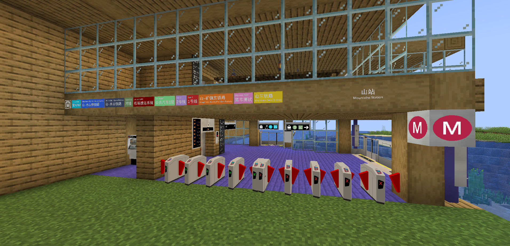

# 山駅

{ width="750" }

山駅（英語：Mountains Station; 中国語：山站）は、1号線、2号線、Home APM、Airport APM、Fast Line、山–木山鉄道、山–広鎮東鉄道、山–三地鉄道、そして1番バス路線が乗り入れる駅です。山路エリアに位置し、約8階建ての非常に大きな駅で、多くの路線の主要な終着駅となっています。2025年8月末ごろに開業しました。

## 歴史

駅の近くにある山にちなんで名付けられ、この駅は最初に運行を開始した駅のひとつでした。開業当初はHome Line（現在の Home APM）とFast Lineのみで、1階部分だけが存在していました。9月初め頃に1号線が開通し、「山鉄道駅」と呼ばれる別の駅が作られました。その後、多くの路線が建設され、混乱を避けるために山鉄道駅は山駅と接続されました。こうして、この駅は主要な乗換駅となりました。

## 出口

出口は A・B・C の3つがあります。出口 C はバリアフリー対応です。

## ギャラリー

<figure markdown="span">
  { width="500" }
  <figcaption>入口A</figcaption>
</figure>

<figure markdown="span">
  { width="500" }
  <figcaption>山鉄道エリア</figcaption>
</figure>

<figure markdown="span">
  { width="500" }
  <figcaption>バスステーション</figcaption>
</figure>

<figure markdown="span">
  { width="500" }
  <figcaption>ビジネスエリア</figcaption>
</figure>

<figure markdown="span">
  { width="500" }
  <figcaption>山駅全景</figcaption>
</figure>
