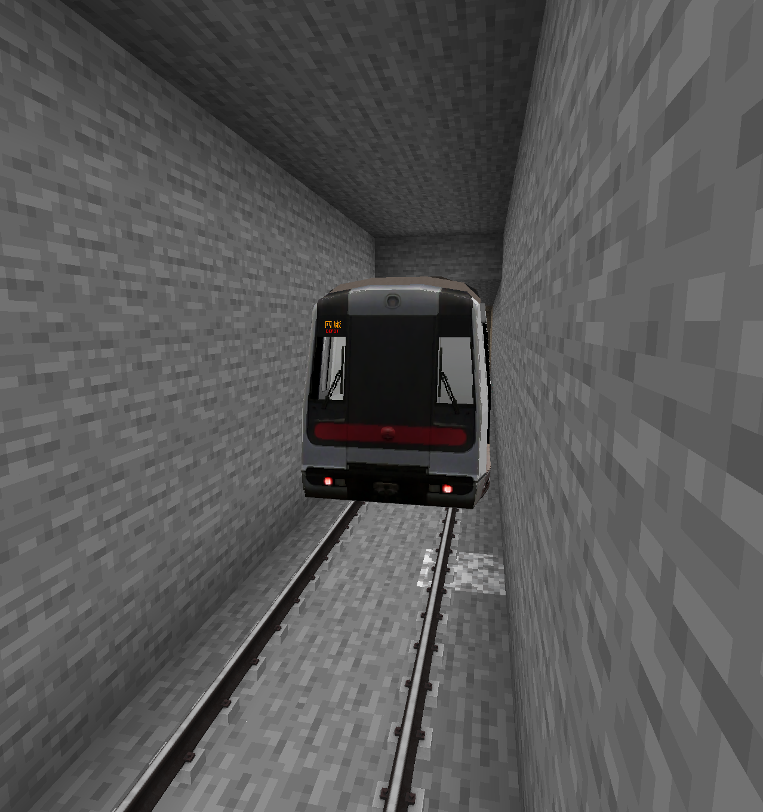

# Line 1

image here

Line 1 (Chinese: 1号线) is a line connecting Mountains to Thompson Road. The line is not long but is kept for historic purposes. It is _______ km long and is the first line in the server to have a rail based system.

## Stations

| Station      | Transfers                          |
| ------------ | ---------------------------------- |
| [Mountains](../stations/mountains)       | Check article.  |
| Lakeside Forest      |          |
| Crumble Mountains    |             |
| Thompson Road (WIP)      |           |

## History

Opened in late August for the use of testing rails, but because of it being very popular, is still kept to this day. 

{ width="750" }

## Extra Info

Line 1 uses the following for the train:  
M-Train Cav (Forwards, Mini)  
Non-refurbished M-Train Cab (Backwards, Small)

