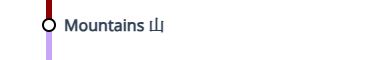

# Stations and Lines

Here is the list of all the stations and lines in my transit world. They are categorized by what area they are in. Click on the station/line for more detailed explanation. (company names are in parantheses)

!!! tip "Image link"

    The image links look better in light mode if you prefer

[Line 1](../lines/lineone) (funmorning metro):  
  
- [Mountains](mountains/)  
- [Lakeside Forest](lakesideforest/)  
- [Crumble Mountain](crumble_mountain/)  
- [Thompson Road](thompson_road/) (Under Construction)  

Line 2 (funmorning metro):  
  
- [Spawn](spawn/)  
- [Mountains](mountains/)  

Line 3 (funmorning metro):  
  
- [Beach](beach/)  
- [Oaklands](oaklands/)  

Airport APM (funmorning metro):  
  
[{ width="380" }](airport_terminal_one/)  
[{ width="380" }](mountains/)  

Home APM (funmorning metro):  
  
[{ width="380" }](home/)  
[{ width="380" }](mountains/)  

Fast Line (funmorning metro):  
  
[{ width="380" }](forest/)  
[{ width="380" }](view/)  
[{ width="380" }](mountains/)  

Village Express (funmorning metro):  
  
[{ width="380" }](forest/)  
[{ width="380" }](village/)  

Mountains-Kiyama Railway (Lanna Railway):  
Any station with the :material-train: icon is stopped on the Mountains Kiyama Railway Express.  
  
- [Mountains](mountains/) :material-train:  
- [Shuliu](shuliu/)  
- [Kuangzhen](kuangzhen/) :material-train:  
- [Norton Forest](norton_forest/)  
- [Kiyama](kiyama/) :material-train:  

Mountains-Kuangzhen East Railway (Lanna Railway):  
  
- [Mountains](mountains/)  
- [Kuangzhen East](kuangzhen_east/)  

Mountains-Sandi Railway (Lanna Railway):  
  
- [Mountains](mountains/)  
- [Sandi](sandi/)  

Kuangzhen-Boston Railway (Kuangzhen Railway):  
  
- [Kuangzhen](kuangzhen/)  
- [Boston](boston/)  

Kuangzhen East-Kuangzhen Connector (Kuangzhen Railway):  
  
- [Kuangzhen East](kuangzhen_east/)  
- [Kuangzhen](kuangzhen/)  

Line 1 (Kuangzhen Railway):  
  
- [Boston](boston/)  
- [Tantem Village](tantem_village/)  
The line then splits into two going to [Jungle](jungle/) or [Dripstone Caverns](dripstone_caverns/).  

Kuangzhen Loop (Kuangzhen Boats):
  
- [Two Ravines](two_ravines/)  
- [Big Hole](big_hole/)  
- [Kuangzhen Village](kuangzhen_village/)  
- [Kuangzhen](kuangzhen/)  

TANTEM TEST (Kuangzhen Boats):  

- [Tantem Village](tantem_village/)  
- Tantem Cave  

Mountains-Kiyama Railway Extension (Lanna Railway Extention):  
  
- [Kiyama](kiyama/)  
- New Lush Caves  
- Lush Caves  

Second Mountains-Kiyama Railway Extension (Lanna Railway Extention):  
  
- [Kiyama](kiyama/)  
- Kishimidō  
- Snowveil  

Kishimidō-Tantem Railway (Hanano Railway - Sendai Area):  
  
- Kishimidō  
- Shirin-mon  
- [Jungle](jungle/)  
- [Tantem Village](tantem_village/) (contruction not started)  