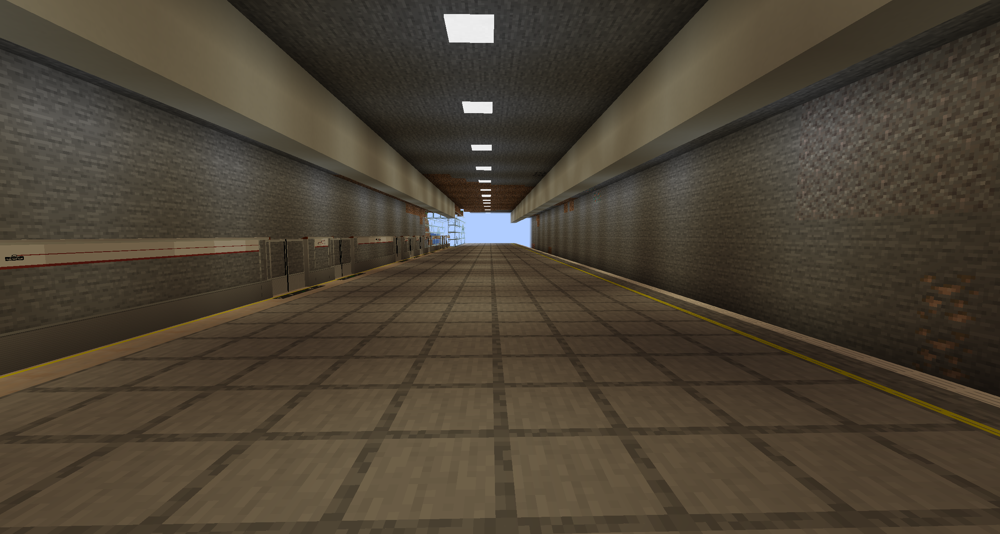

# Boston Station

{ width="750" }

Boston Station (Chinese: 波斯顿站) is a station on Line 1 and the Kuangzhen-Boston Railway in the Kuangzhen area. 

## History

This station opened around the middle of October 2025 and did not have a transfer until the end of October 2025.

## Gallery

<figure markdown="span">
  { width="500" }
  <figcaption>Platforms</figcaption>
</figure>

Platform 1 (on the left) is on Line 1. Platform 2 (on the right) is on the Kuangzhen-Boston Railway.