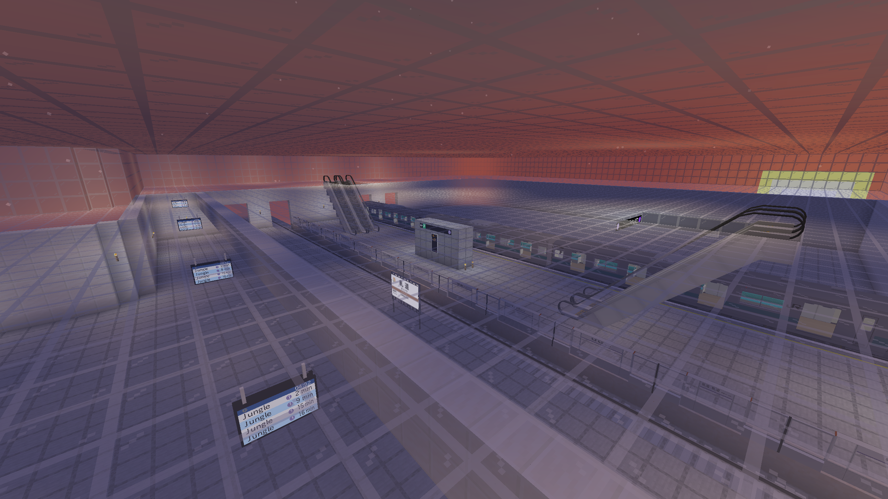
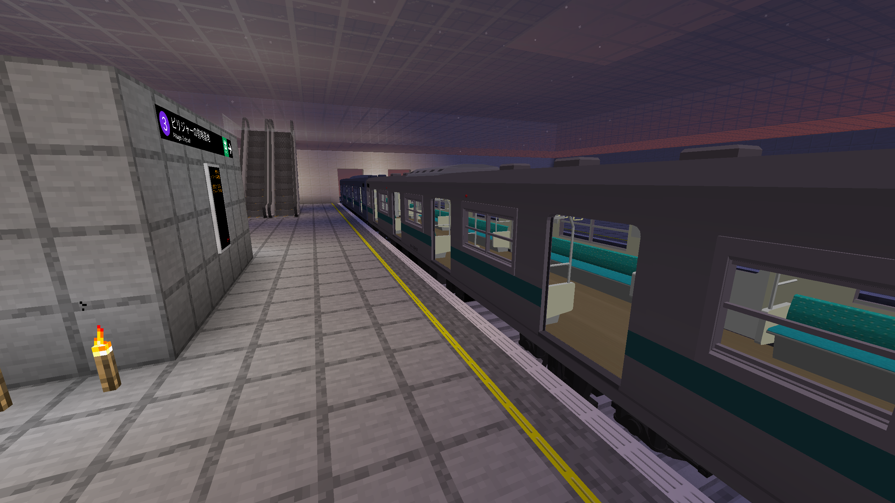

# Kishimidō Station

{ width="750" }

Kishimidō Station (Japanese: 軋道駅; Chinese: 轧道站) is a station on the Second Mountains-Kiyama Railway Extension, Kishimidō-Tantem Line, and the Mineshaft Line. It is in Sendai area and was fully completed on the first week of November 2025.

## History

Kishimidō did not have a large exit until the on-land platforms were created. More lines have been planned for creation. It is the biggest station on land. (biggest station in ground is Kiyama.)

## Gallery

<figure markdown="span">
  { width="750" }
  <figcaption>Platforms</figcaption>
</figure>

<figure markdown="span">
  { width="750" }
  <figcaption>Concourse</figcaption>
</figure>

<figure markdown="span">
  { width="750" }
  <figcaption>Elevator</figcaption>
</figure>

<figure markdown="span">
  { width="750" }
  <figcaption>Platform 1+</figcaption>
</figure>

<figure markdown="span">
  { width="750" }
  <figcaption>Floor -1 Elevator</figcaption>
</figure>

<figure markdown="span">
  { width="750" }
  <figcaption>Platform 3</figcaption>
</figure>

<figure markdown="span">
  { width="750" }
  <figcaption>Kishimidō Station</figcaption>
</figure>

