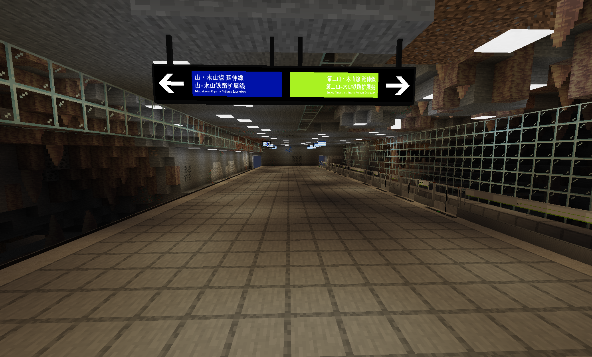
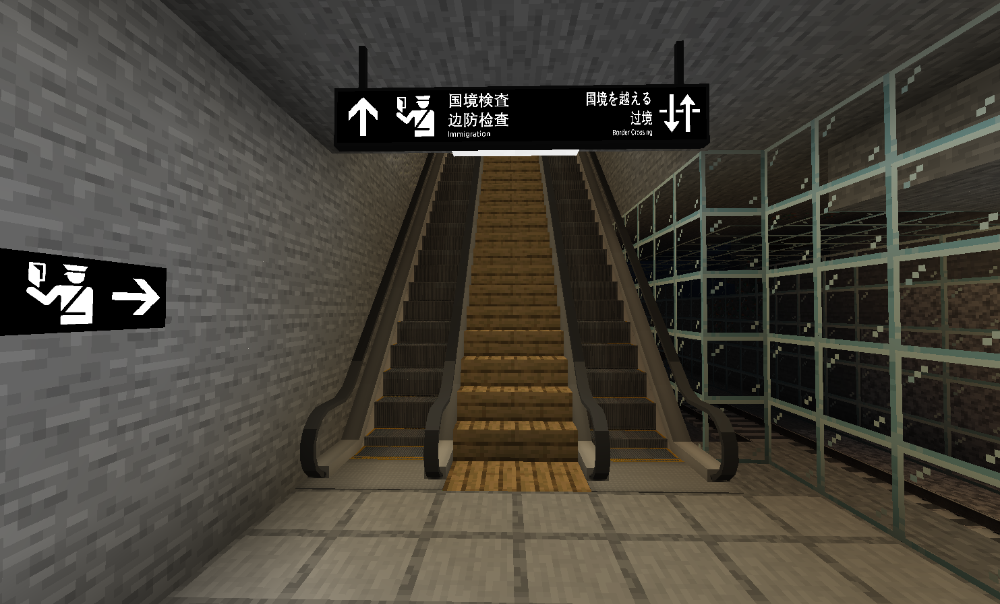
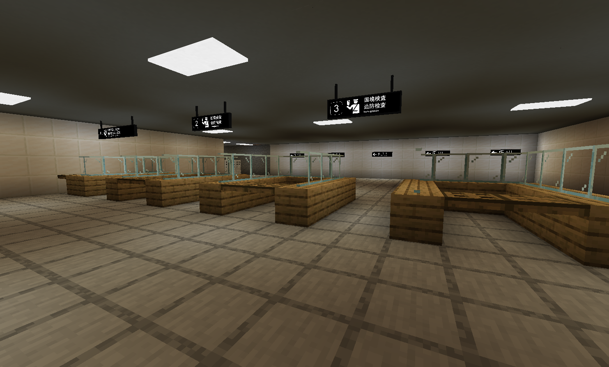

# Kiyama Station

{ width="750" }

Kiyama Station (Japanese: 木山駅; Chinese: 木山站) is a station on Mountains-Kiyama Railway, Mountains-Kiyama Railway Extension and the Second Mountains-Kiyama Railway Extension. It is in Sendai area and was opened on September 5, 2025.

## History

On the opening date it had no exit or entrance and served as a small transfer station to Shōnyūdō (鍾乳洞) and you could wait to get a ride on the Mountains-Kiyama Railway Extension, but the line to Shōnyūdō closed due to the station and line being too short and unnecessary. On November 3, 2025, Kiyama Station was split into two and required passports to enter Hanano.

### Kiyama Split

When the two stations split, the old Mountains-Kiyama Railway platform would be its own station called Kiyama Checkpoint (木山検問所) and after a security check you would enter Kiyama Station. The new Kiyama station features an exit, transfers to the two extension lines and is located in a cave.

## Gallery

<figure markdown="span">
  { width="500" }
  <figcaption>Exit A</figcaption>
</figure>

<figure markdown="span">
  { width="750" }
  <figcaption>Checkpoint Platform</figcaption>
</figure>

<figure markdown="span">
  { width="750" }
  <figcaption>Platforms</figcaption>
</figure>

<figure markdown="span">
  { width="750" }
  <figcaption>To Immigration from Lanna</figcaption>
</figure>

<figure markdown="span">
  { width="750" }
  <figcaption>Lanna Security</figcaption>
</figure>

<figure markdown="span">
  { width="750" }
  <figcaption>Hanano Security</figcaption>
</figure>

<figure markdown="span">
  { width="750" }
  <figcaption>Welcome to Lanna</figcaption>
</figure>

<figure markdown="span">
  { width="750" }
  <figcaption>Welcome to Hanano</figcaption>
</figure>