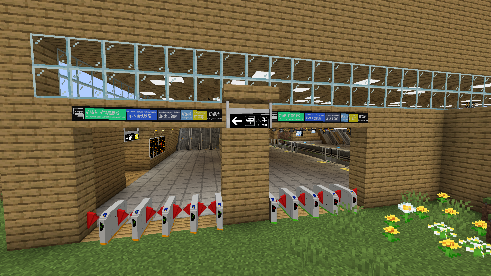

# Kuangzhen

{ width="750" }

Kuangzhen Station (Chinese: 矿镇站) is a station on Mountains-Kiyama Railway, Kuangbo Line, Kuangzhen Loop, and the Kuangzhen East-Kuangzhen Connector Line. It is around the 3rd biggest station in the server and is in the Kuangzhen area. It was opened around September 2025. It uses a side platform for the Mountains-Kiyama Railway.

## History

Named after the village nearby, it had many renovations until is was partially completed around the middle of September.

## Gallery

<figure markdown="span">
	{ width="750" }
	<figcaption>Concourse</figcaption>
</figure>

<figure markdown="span">
	{ width="750" }
	<figcaption>Floor 1</figcaption>
</figure>

<figure markdown="span">
	{ width="750" }
	<figcaption>Floor -1</figcaption>
</figure>

<figure markdown="span">
	{ width="750" }
	<figcaption>Boat Dock</figcaption>
</figure>

<figure markdown="span">
	{ width="750" }
	<figcaption>Track Layout (Floor 1)</figcaption>
</figure>