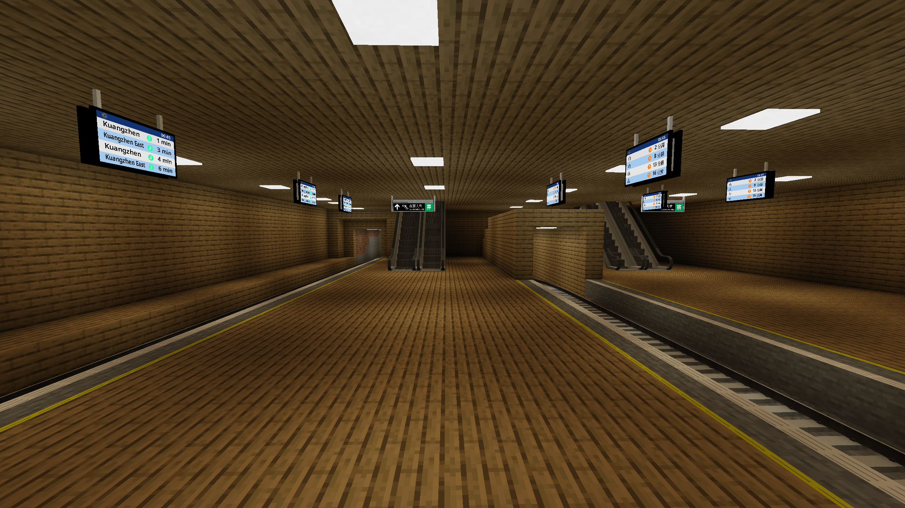

# Kuangzhen East Station

{ width="750" }

Kuangzhen East Station (Chinese: 矿镇东站) is a station on the Mountains-Kuangzhen East Railway, and the Kuangzhen East-Kuangzhen Connector Line. It is a very bigg but empty station and is in the Kuangzhen area. It was opened around early November 2025.

## Gallery

<figure markdown="span">
	{ width="750" }
	<figcaption>Concourse</figcaption>
</figure>

<figure markdown="span">
	{ width="750" }
	<figcaption>Platforms</figcaption>
</figure>