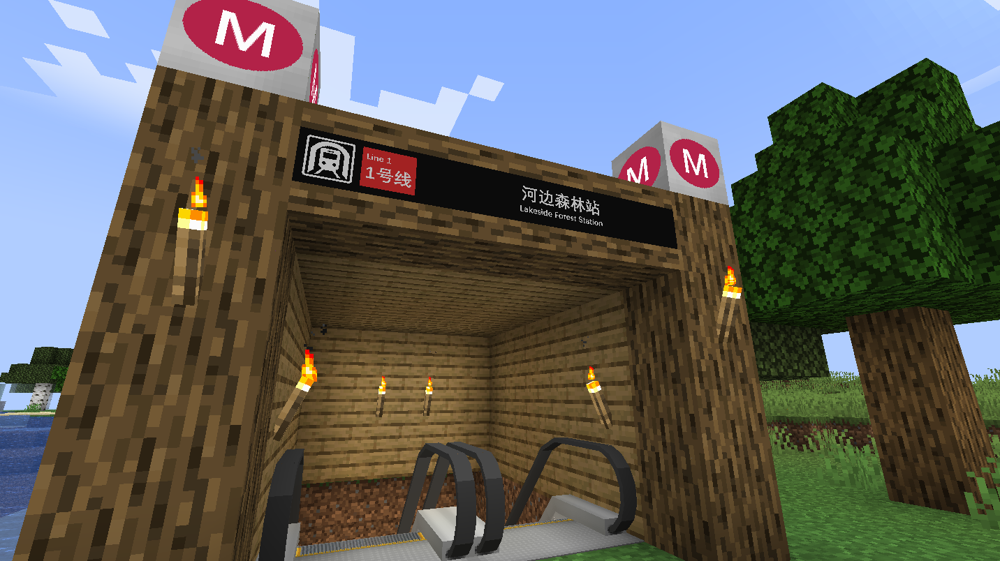

# Lakeside Forest Station

{ width="750" }

Lakeside Forest Station (Chinese: 河边森林站) is a station on Line 1 located in Shanlu area, it is one of the stations which opened in Sept. 2025 named after the lake being close to the forest. It uses a island platform layout for Line 1.

## Gallery

<figure markdown="span">
  { width="500" }
  <figcaption>Platform</figcaption>
</figure>

<figure markdown="span">
  { width="500" }
  <figcaption>Concourse</figcaption>
</figure>

## Extra Info

Lakeside Forest's Chinese name was mistranslated to **河**边森林站 wehn it should be **湖**边森林站 but is still kept for historical reasons