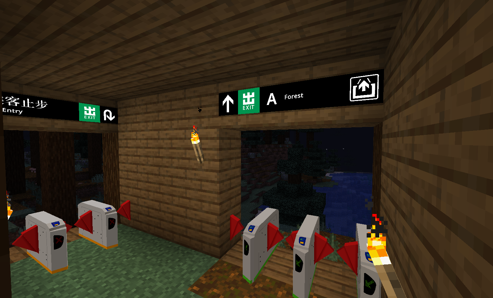
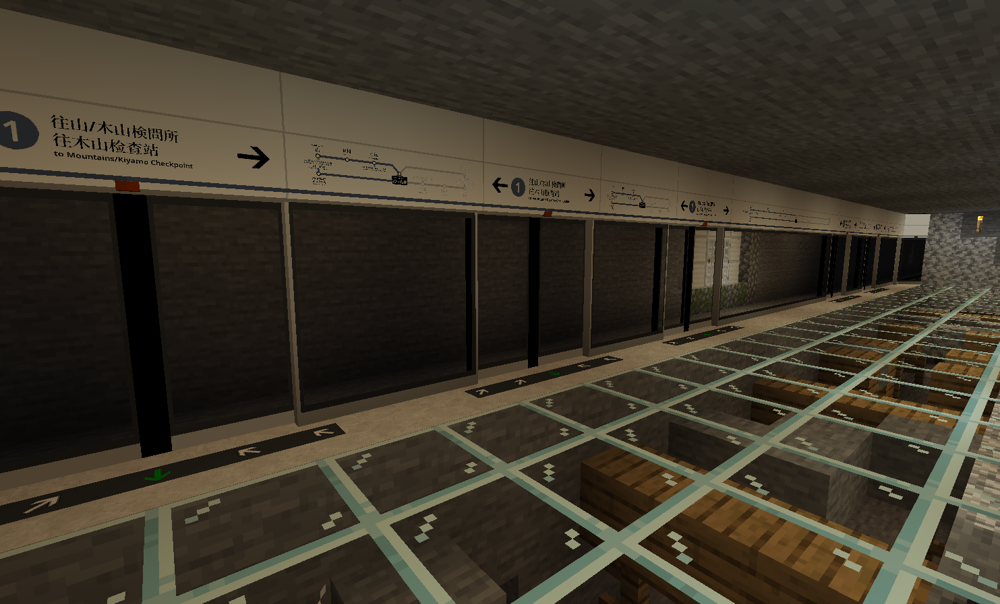

# Norton Forest Station

{ width="750" }

Norton Forest Station (Chinese: 诺屯森林站) is a station on Mountains-Kiyama Railway in the Kuangzhen area. It was opened around September 2025.

## Gallery

<figure markdown="span">
	{ width="750" }
	<figcaption>Stairs to Platform</figcaption>
</figure>

<figure markdown="span">
	{ width="750" }
	<figcaption>Exit A</figcaption>
</figure>

<figure markdown="span">
	{ width="750" }
	<figcaption>Platform 1 of Norton Forest Station</figcaption>
</figure>