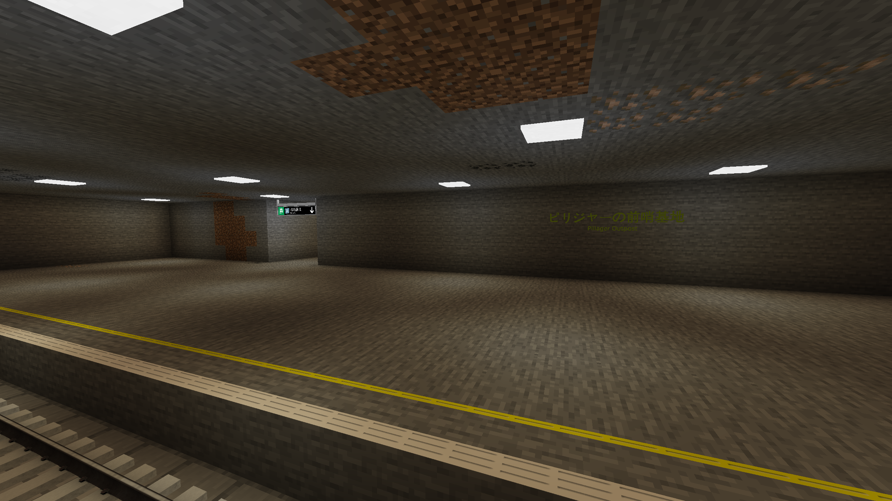

# Pillager Outpost Station

{ width="750" }

Pillager Outpost Station (Japanese: ピリジャーの前哨基地駅) is a station on the Mineshaft Line in the Sendai area. It was opened on January 13, 2026.

## Gallery

<figure markdown="span">
	{ width="750" }
	<figcaption>Platform</figcaption>
</figure>

*This article about a train station in Sendai needs more info. You can help expand it by clicking [here](../expansion.md).*