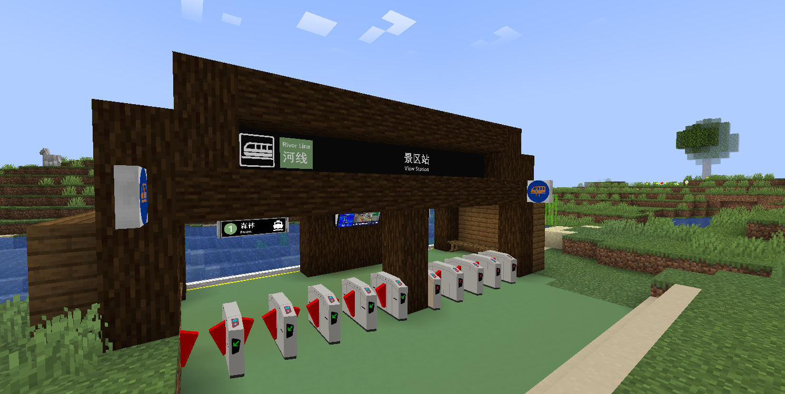
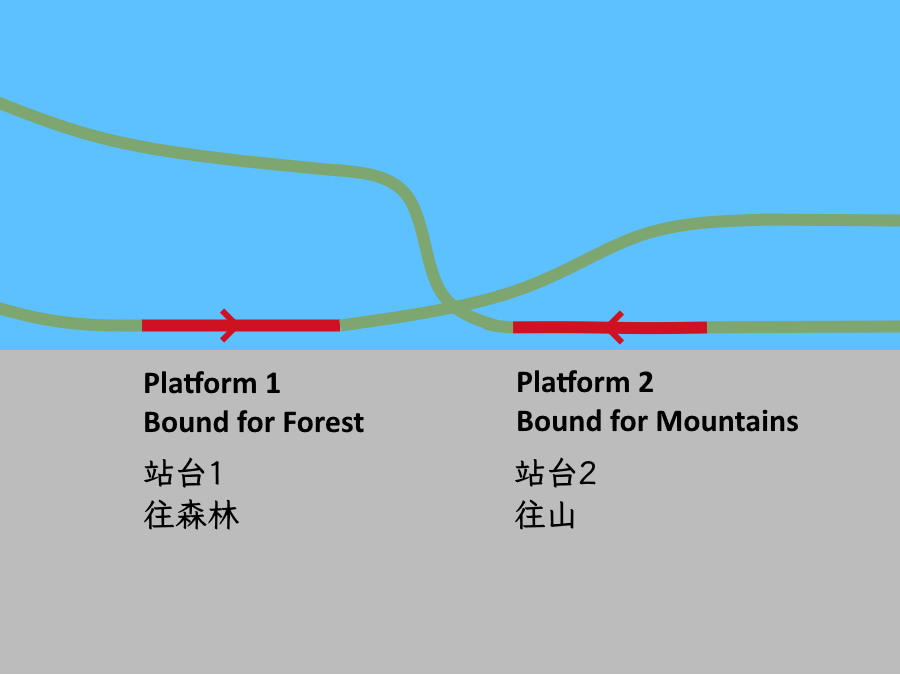

# View Station

{ width="750" }

View Station (Chinese: 景区站) is a station on the Fast Line in the Shanlu area. 

## History

It is named after the nice hill view near on the exit of the station and it is one of the stations to open during late August 2025.

## Gallery

<figure markdown="span">
  { width="500" }
  <figcaption>Entrance A</figcaption>
</figure>

<figure markdown="span">
  { width="500" }
  <figcaption>Platform View</figcaption>
</figure>

<figure markdown="span">
  { width="500" }
  <figcaption>Track Layout</figcaption>
</figure>