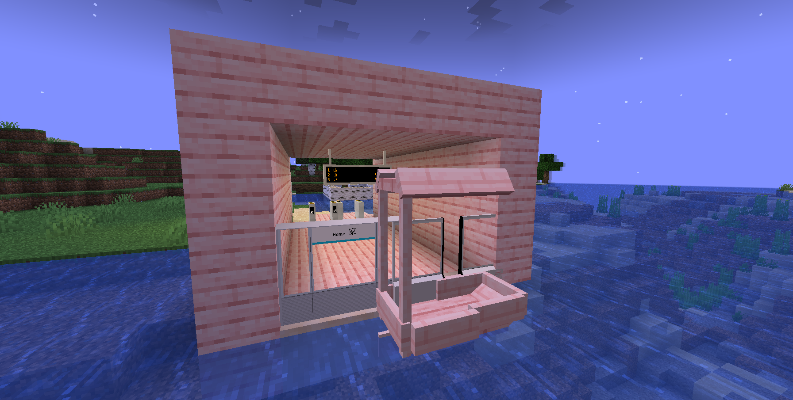

# 家站

{ width="750" }

山站（英语：Home Station）是在山陆区域的家APM站。本站旁边有一个樱桃木家还在八月2025开通。

## 历史

funmorning公共交通第一个站，是一个很小的站为了开玩笑而已但是从现在还保留因为历史原因。

## 图片

<figure markdown="span">
  { width="500" }
  <figcaption>站台</figcaption>
</figure>